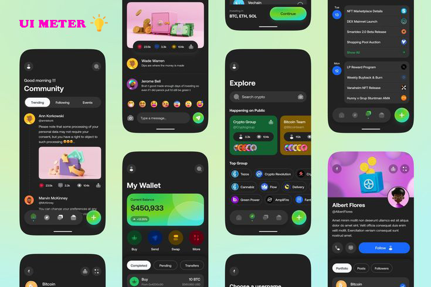

# React Native UI Meter

Introducing our comprehensive React Native UI library, designed to streamline your app development process. This library includes customizable App Themes, Cross-platform compatibility for both iOS and Android. It features a rich collection of pre-built components, powerful hooks for enhanced functionality, intuitive form state management, and integrated query handling for efficient data management. With this library, you can create beautiful, functional, and responsive applications effortlessly, providing a seamless and efficient development experience.



## Installation

```sh
npm install ui-meter
```

## Usage

```tsx
import { Box, Center, Text } from 'ui-meter';

export default function App() {
  return (
    <Box>
      <Center height="100%">
        <Text color="red" fontWeight="bold" fontSize={20}>
          Hello World
        </Text>
      </Center>
    </Box>
  );
}
```

## Features

- App Theme
- Cross platform Universal
- Components
- Hooks
- From state handle
- Query support

## API Reference

- [Installation](#installation)
- [Usage](#usage)
- [Components](#components)
  - [Layout](#layout)
    - [Box](#box)
    - [Center](#center)
    - [HStack](#hstack)
    - [VStack](#vstack)
    - [Divider](#divider)
  - [Typography](#typography)
    - [Text](#text)
    - [Heading](#heading)
  - [From](#from)
    - [Button](#button)
    - [CheckBox](#checkbox)
- [Props](#props)
  - [Layout Props](#layout-props)
  - [Typography Props](#typography-props)
- [Contributing](#contributing)
- [Support](#support)
- [Feedback](#feedback)
- [FAQ](#faq)
- [Links](#links)
- [Authors](#authors)
- [License](#license)

## Components

Introducing our comprehensive React Native UI library with customizable themes, universal components, powerful hooks, efficient form state handling, and integrated query support. Create beautiful, functional, and responsive applications effortlessly.

### Layout

#### Box

```tsx
import { Box, Text } from 'ui-meter';

export default function () {
  return (
    <Box backgroundColor="red" padding={50} borderRadius={10}>
      <Text textAlign="center">This is the Box</Text>
    </Box>
  );
}
```

#### Center

```tsx
import { Box, Text, Center } from 'ui-meter';

export default function () {
  return (
    <Center>
      <Box backgroundColor="red" padding={50} borderRadius={10}>
        <Text textAlign="center">This is the Box</Text>
      </Box>
    </Center>
  );
}
```

#### HStack

```tsx
import { Box, Text, HStack } from 'ui-meter';

export default function () {
  return (
    <HStack>
      <Box backgroundColor="red" padding={50} borderRadius={10}>
        <Text textAlign="center">This is the Box</Text>
      </Box>
      <Box backgroundColor="red" padding={50} borderRadius={10}>
        <Text textAlign="center">This is the Box</Text>
      </Box>
    </HStack>
  );
}
```

#### VStack

```tsx
import { Box, Text, VStack } from 'ui-meter';

export default function () {
  return (
    <VStack>
      <Box backgroundColor="red" padding={50} borderRadius={10}>
        <Text textAlign="center">This is the Box</Text>
      </Box>
      <Box backgroundColor="red" padding={50} borderRadius={10}>
        <Text textAlign="center">This is the Box</Text>
      </Box>
    </VStack>
  );
}
```

#### Divider

```tsx
import { Box, Text, Center, Divider } from 'ui-meter';

export default function App() {
  return (
    <Center height={'100%'}>
      <Box width={200}>
        <Box backgroundColor="red" padding={50} borderRadius={10}>
          <Text textAlign="center">This is the Box</Text>
        </Box>
        <Divider m={10} backgroundColor={'green'} orientation="horizontal" />
        <Box backgroundColor="red" padding={50} borderRadius={10}>
          <Text textAlign="center">This is the Box</Text>
        </Box>
      </Box>
    </Center>
  );
}
```

### Typography

#### Text

```tsx
import { Box, Center, Text } from 'ui-meter';

export default function App() {
  return (
    <Box>
      <Center height="100%">
        <Text color="red" fontWeight="bold" fontSize={20}>
          Hello World
        </Text>
      </Center>
    </Box>
  );
}
```

#### Heading

```tsx
import { Box, Center, Heading } from 'ui-meter';

export default function App() {
  return (
    <Box>
      <Center height="100%">
        <Heading color="red">Hello World</Heading>
      </Center>
    </Box>
  );
}
```

#### Button

```js
import { Center, Button, ButtonText } from 'ui-meter';

export default function App() {
  const handlePress = () => {
    console.log('hello world!');
  };

  return (
    <Center flex={1}>
      <Button onPress={handlePress}>
        <ButtonText>Click Me</ButtonText>
      </Button>
    </Center>
  );
}
```

#### CheckBox

```js
import { Center, Checkbox } from 'ui-meter';

export default function App() {
  const handleCheck = (check: boolean) => {
    console.log(check);
  };

  return (
    <Center flex={1}>
      <Checkbox onCheck={handleCheck} label="Label" />
    </Center>
  );
}
```

## Contributing

Pull requests are welcome. For major changes, please open an issue first
to discuss what you would like to change.

Please make sure to update tests as appropriate.

## Support

For support, email devrejaul.official@gmail.com

## Feedback

If you have any feedback, please reach out to us at devrejaul.official@gmail.com

## FAQ

#### Question 1

Answer 1

#### Question 2

Answer 2

## 🔗 Links

[](https://www.linkedin.com/in/rezaul-karim-823a9a227/)
[](https://x.com/DeveloperRejaul)

## Authors

- [@rezaulkarim](https://github.com/DeveloperRejaul)

## License

[MIT](https://choosealicense.com/licenses/mit/)

```

```
